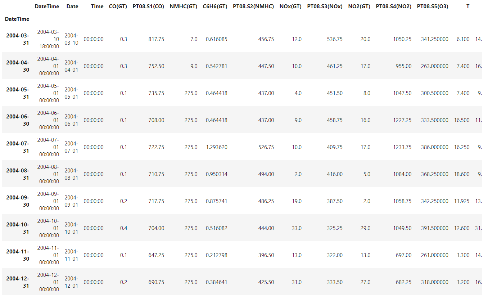
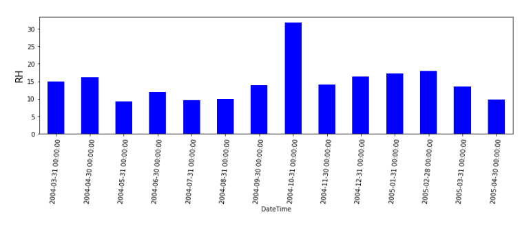
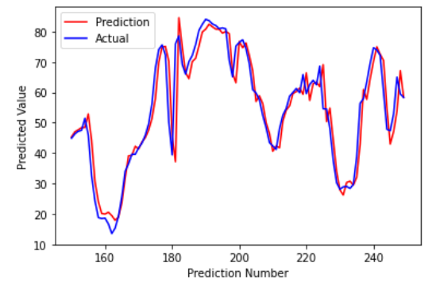
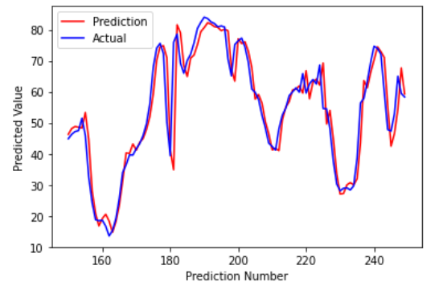

AIR QUALITY FORECAST

TIME SERIES FORECASTING AND ANALYSIS USING DEEP LEARNING TECHNIQUE - USE OF LSTM AND DENSE LAYERS

Real Multivariate, Time-Series AIR QUALITY DATASET FROM https://archive.ics.uci.edu/ml/datasets/Air+Quality
 

DATASET  

 
 
PREDICTED ATTRIBUTE RELATIVE HUMIDITY  

 
 
INITIAL MODEL  

 
 
IMPROVED MODEL  

 
 
